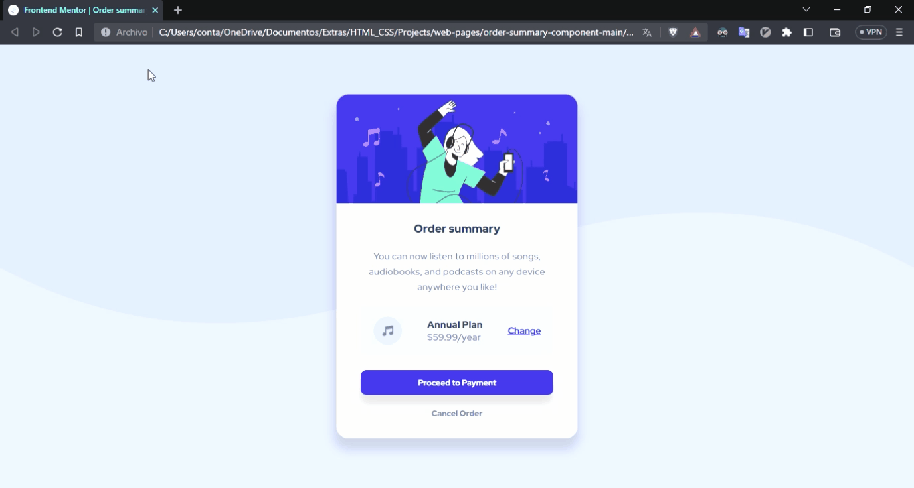

# web-pages
This repository has some web pages that I have made.

  

### In the [WebAnime](https://github.com/RoboG-11/web-pages/tree/main/WebAnime) repository
Found a web page that contains a list of 9 anime in no particular order.

This is a gif showing the content of the page:

 

  

### In the [order-summary-component-main](https://github.com/RoboG-11/web-pages/tree/main/order-summary-component-main) repository
There is a small exercise from the [frontendmentor](https://www.frontendmentor.io/) page.

This is a gif showing the content of the page:

  

### In the [coinbase](https://github.com/RoboG-11/web-pages/tree/main/coinbase) repository
This is a [Connie Tai](https://www.figma.com/@luckystar2) design that I transformed to web.

This is a gif showing the content of the page:

  

### Coming soon...
